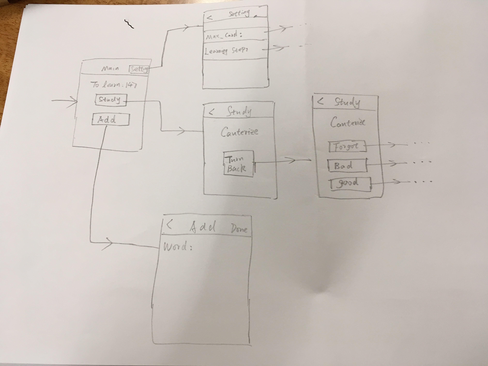
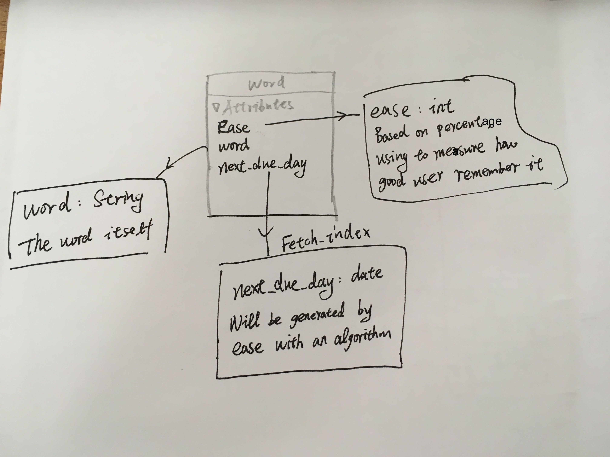

# Final Project: MyAnKi FlashCard on IOS

## Introduction

"AnKi is a  a program which makes remembering things easy. Because it's a lot more efficient than traditional study methods, you can either greatly decrease your time spent studying, or greatly increase the amount you learn." ([Link to its website](https://apps.ankiweb.net))

Currently it has Windows, Mac, Linux, IOS and Android version, although it is a opensource application, but IOS version has not yet released its code and it's now selling on App Store for about $30.

## Why choose it as my imitation object?

- I know every detail of it. I have used it for about 6 months to study GRE words, manging 10,000 words with multiple media files including pictures and sounds.
- A little bit challenging but viable. I can now imagine how to design its UI and manipulate CoreData to implement its function, but there is a challenging part that I need to find a way to schedule cards properly, which is the essence of AnKi.

## Functionalities
- Using Navigation controller as its container.
- Containing 4 or 5 scenes, which are "main", "setting", "editing", "studying" (and "adding"?)
- Auto layout out of box.
- Comes with a GRE-word database out of box.
- Original Anki can have multiple decks, which is the database, for this project, I will probably use only one fixed deck.
- Considering the time we have, I might not allow users to add multiple media files, and they can only study words only.

## Imagined UI design

## Core Data design
